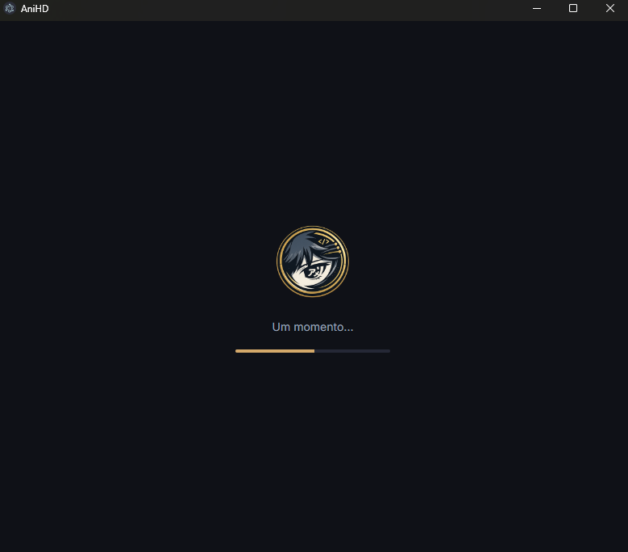
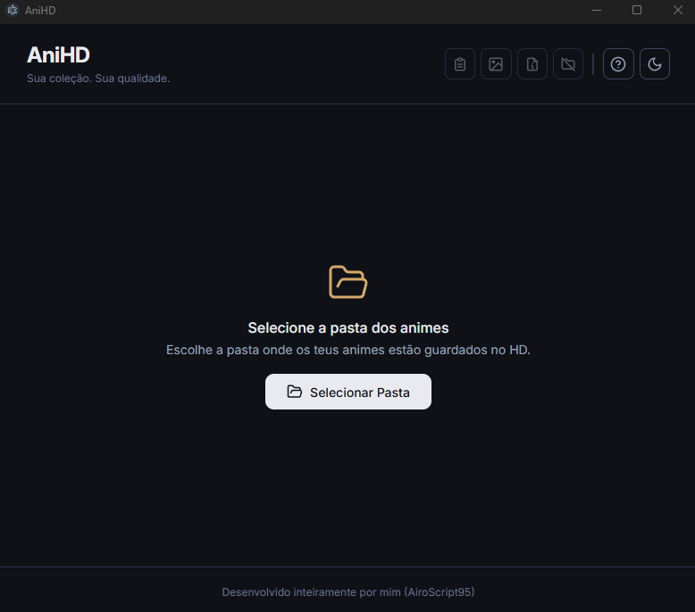
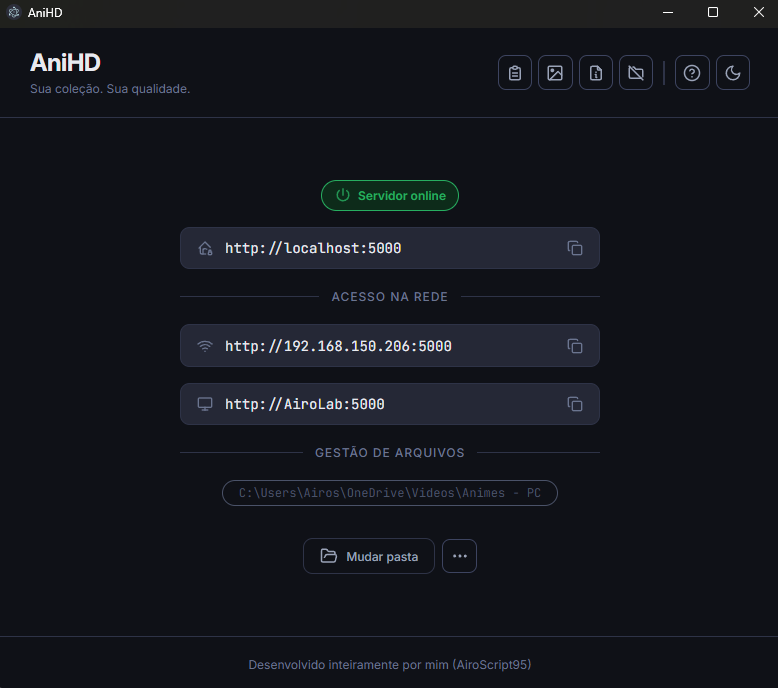
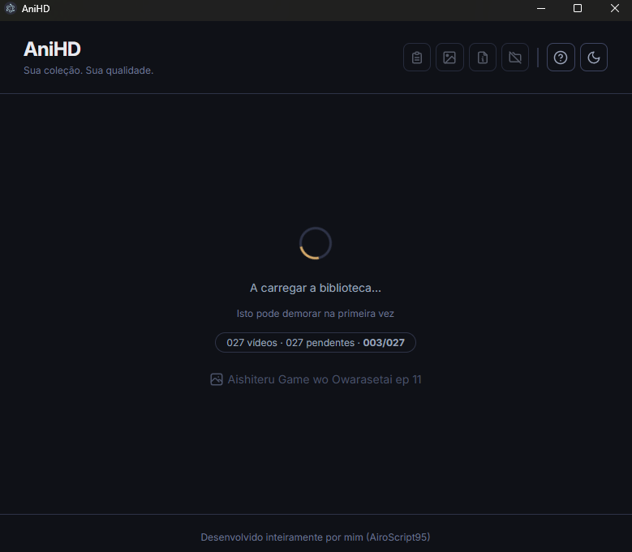
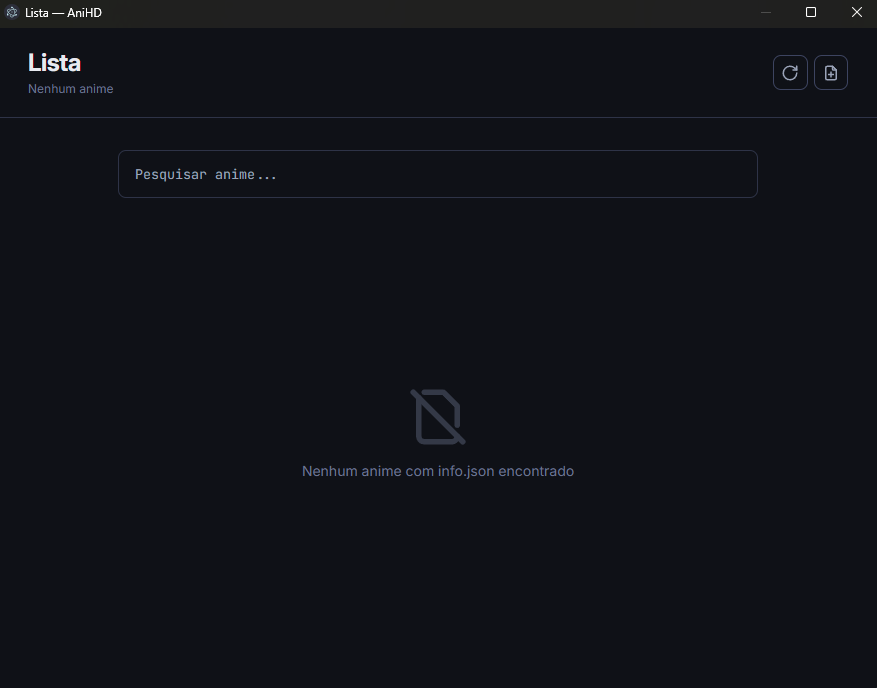
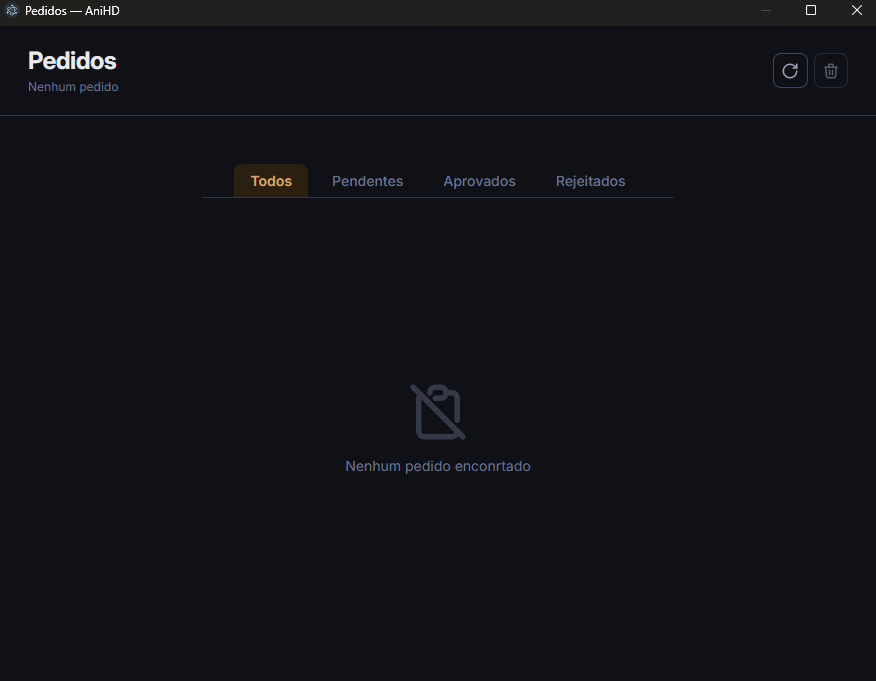

# 🎌 AniHD App

App desktop para iniciar e gerir o teu servidor de streaming de animes em rede local — sem precisares de saber programar nem abrir um terminal.

## ✨ O que faz

- 🖼️ Gera thumbnails automaticamente para todos os teus vídeos
- 📡 Inicia o servidor de streaming na tua rede local
- 📺 Permite aceder aos teus animes em qualquer dispositivo (PC, telemóvel, TV)
- 🌙 Tema claro e escuro automático (segue o sistema)
- 📋 Mostra o endereço de acesso local e em rede
- 🗂️ Permite redefinir a pasta de vídeos a qualquer momento
- 🖼️ Acesso direto à pasta de banners
- 📋 Janela dedicada para gerir pedidos de novos animes
- 📝 Janela dedicada para editar e organizar info.json de cada anime

## 💻 Plataformas suportadas

| Sistema     | Suporte |
| ----------- | ------- |
| Windows 10/11 | ✅    |
| Linux       | ✅      |
| macOS       | ✅      |

## 📥 Instalação

### Windows
1. Descarrega o instalador `.exe` na secção [Releases](https://github.com/AiroScript95/anihd-app/releases)
2. Executa o instalador e segue os passos
3. O AniHD fica disponível no Menu Iniciar e no Ambiente de Trabalho

### Linux / macOS
> Em breve — podes correr em modo desenvolvimento por agora.

## 🚀 Como usar

1. **Abre o AniHD App**
2. **Seleciona a pasta** onde tens os teus animes organizados
3. **Aguarda** — o app gera as thumbnails automaticamente (pode demorar na primeira vez)
4. **O servidor inicia** sozinho após as thumbnails estarem prontas
5. **Copia o endereço** que aparece no app e abre no browser de qualquer dispositivo da tua rede

## 📡 Acesso na rede

Após o servidor iniciar, o app mostra-te três endereços:

| Endereço | Quando usar |
|---|---|
| `http://localhost:5000` | No mesmo PC |
| `http://192.168.x.x:5000` | Em qualquer dispositivo da rede pelo IP |
| `http://NOME-DO-PC:5000` | Em qualquer dispositivo pelo nome do PC (requer mDNS) |

## 📁 Como organizar os teus animes

O servidor lê automaticamente a estrutura de pastas do teu HD:

```
Animes - HD/
├── Anime A/
│   ├── info.json
│   ├── capa.jpg
│   ├── Temporada 1/
│   │   ├── EP01.mp4
│   │   └── EP02.mp4
│   └── Temporada 2/
│       └── EP01.mkv
├── Anime B/
│   ├── info.json
│   ├── capa.png
│   └── EP01.mp4
└── Filmes/
    ├── Filme A/
    │   ├── capa.jpg
    │   └── filme.mp4
    └── Filme B/
        ├── capa.jpg
        └── filme.mp4
```

## 📄 info.json (opcional mas recomendado)

Podes adicionar um ficheiro `info.json` dentro de cada pasta de anime com os metadados:

```json
{
  "categorias": ["Ação", "Aventura"],
  "sinopse": "Sinopse geral do anime...",
  "status": "em curso",
  "year": "2024",
  "seasons": {
    "Temporada 1": {
      "sinopse": "Sinopse específica da temporada 1...",
      "status": "completo",
      "year": "2023"
    }
  }
}
```

**Valores de status:** `completo` · `em breve` · `download` · `a expirar` · `em curso`

Se uma temporada não tiver `sinopse`, `status` ou `year`, herda automaticamente os valores da raiz.

## 🖼️ Thumbnails

As thumbnails são geradas automaticamente quando abres o app pela primeira vez ou quando mudas de pasta. O progresso é mostrado em tempo real no app.

Para regenerar as thumbnails manualmente (ex: após adicionar novo conteúdo), usa a opção disponível nas definições do app.

**Como são geradas:**
1. Tenta extrair a thumbnail embutida nos metadados do vídeo (comum em MKV)
2. Se não existir, captura um frame do vídeo via FFmpeg

## ⚙️ Funcionalidades do servidor incluído

O AniHD App inclui o servidor AniHD integrado. Funcionalidades disponíveis:

- 📺 Streaming em tempo real com suporte a Range requests
- 📥 Download de episódios com limite por IP
- 🔍 Pesquisa de animes integrada
- 📋 Sistema de pedidos para sugerir novos animes
- 🗂️ Suporte a temporadas e múltiplos formatos (MP4, MKV)
- ⚡ Cache em memória com TTL de 30 minutos
- 🏷️ Metadados por anime via `info.json`

## 🛠️ Tecnologias

| Tecnologia | Uso |
|---|---|
| Electron | App desktop |
| Node.js | Runtime |
| Express 5 | Servidor HTTP |
| FFmpeg | Geração de thumbnails |
| Sharp | Processamento de banners |
| HTML / CSS / JS | Interface do utilizador |

## 🔧 Desenvolvimento

```bash
# Clona o repositório
git clone https://github.com/AiroScript95/anihd-app.git
cd anihd-app

# Instala as dependências
npm install

# Corre em modo desenvolvimento
npm run dev

# Gera o instalador
npm run dist
```
## 📷 Visualisação
### Loading

### Seleção de Pasta

### Servidor ligado

### Geração de Thumbnails

### Lista de animes com info

### Pedidos


## 📜 Licença

GPL-3.0 — Projecto pessoal para uso privado em rede local.

Desenvolvido por **AiroScript95**
